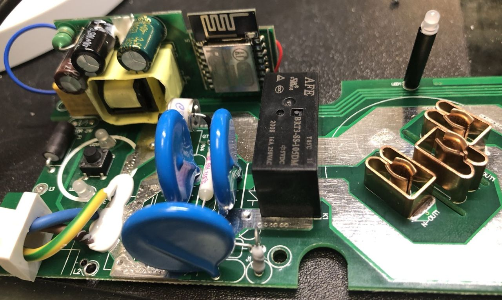

## Marmitek Smart Home Devices Reverse Engineering

This repository contains documentation about Marmitek WiFi Plug Power SE and WiFi socker strip Power Li.
The motivation is to replace the existing WiFi module/firmware with the excellent ESPHome project.

### Sponsoring

All my reverse engineering work is paid with my low little budget, so every donation is very welcome, either through the Patreon link on the side or through Paypal Me:

[Paypal Me](https://paypal.me/renderingfun)

### Update

#### 24.04.2021

- Use of BL0937 custom component for Power Li socket strip
- Added information about the Power SI WiFi plug

#### 12.03.2021

- Added first draft of Power Li socket strip schematic
- Added first version of Power Li YAML file

#### 11.03.2021

- Added BL0937 AC measurement IC datasheet used in Power Li strip
- Added TyWE2S and WR3E datasheets
- Added ESPHome yaml file for the Power SE WiFi Plug.
- Uploaded picture of Power SE ESP12-E modification

### Power SE ESPHome modification

Replaced the TYWE2S module with an ESP12-E.

### Power Li ESPHome modification

Replaced the WR3E module with an ESP12-E.

#### What is working

- Switching on/off all 4 relays
- Detect reset button

#### What is not working

- Although the ESP12E module is pin compatible with the original module, TXD as GPIO1 can't be used for turning on the USB charger supply as during power up TXD detects a pull down and disables booting.

### Power SI ESPHome modification

The Power SI WiFi plug is similar to the Power SE plug but with added BL0937 power metering IC and two USB charging outputs.
It also uses the TYWE2S WiFi module which needs to be replaced for example with an ESP-M3 module due to space limitation inside.

Following pins of the TYWE2S module have been identified:

                       3V3 Power
    05  CF1 BL0937
                       GND Power
    04  CF BL0937
                       RX  Push Button
    13  WiFi LED
                       TX
    AD  -
                       12  SEL BL0937
    RST 
                       14  Relais
