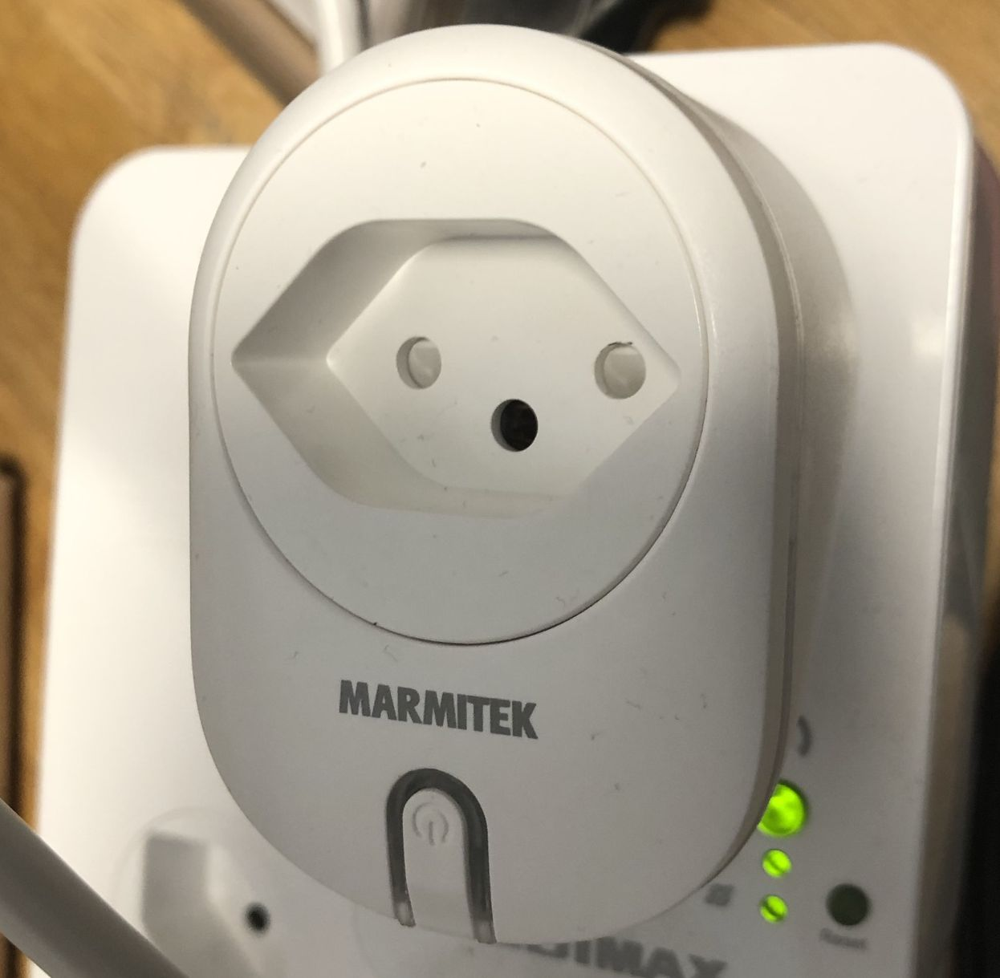

# Marmitek Smart Home Devices Reverse Engineering

This repository contains documentation about Marmitek Smart Home devices, mainly WiFi power plugs and WiFi power strips like the Power Li.

The motivation is to replace the existing WiFi module/firmware with the excellent ESPHome project.

## Power SE ESPHome modification

Replaced the TYWE2S module with a ESP12-E.

