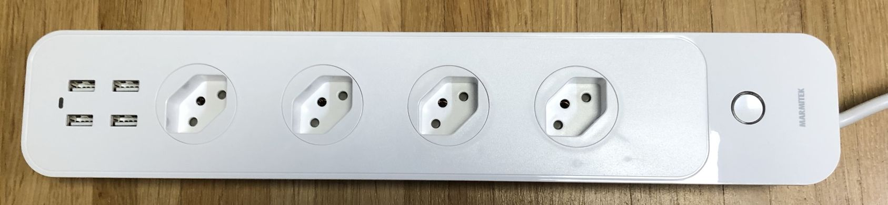
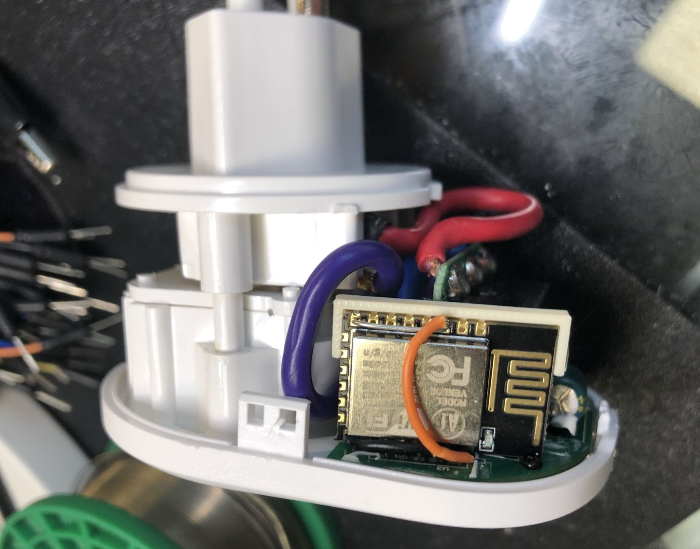

## Marmitek Smart Home Devices Reverse Engineering

This repository contains documentation about Marmitek WiFi Plug Power SE and WiFi socker strip Power Li.
The motivation is to replace the existing WiFi module/firmware with the excellent ESPHome project.

### Sponsoring

All my reverse engineering work is paid with my low little budget, so every donation is very welcome, either through the Patreon link on the side or through Paypal Me:

[Paypal Me](https://paypal.me/renderingfun)

### Update

#### 12.03.2021

- Added first draft of Power Li socket strip schematic

#### 11.03.2021

- Added BL0937 AC measurement IC datasheet used in Power Li strip
- Added TyWE2S and WR3E datasheets
- Added ESPHome yaml file for the Power SE WiFi Plug.
- Uploaded picture of Power SE ESP12-E modification

### Power SE ESPHome modification

Replaced the TYWE2S module with a ESP12-E.

